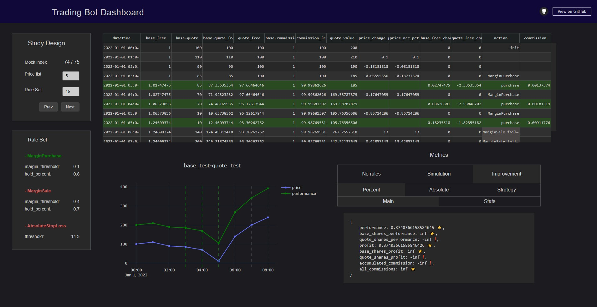

A trading bot dashboard to explore metrics and operations, 
implemented using [Dash](https://plotly.com/dash/).

It uses a bot I created named `Nakamoto`, and a minimal 
version of it is inside this code to make it work. 

Settings can not be changed since data used for this 
presentation is already fixed. The original purpose
of this dashboard is to visualize test data to manually
ensure that the bot works as expected.

Screenshot:

